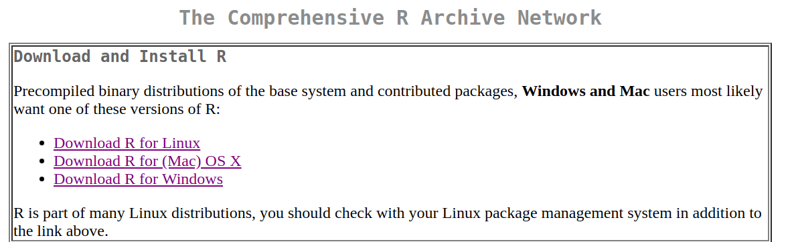
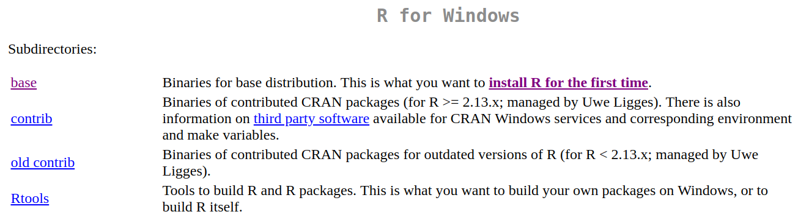
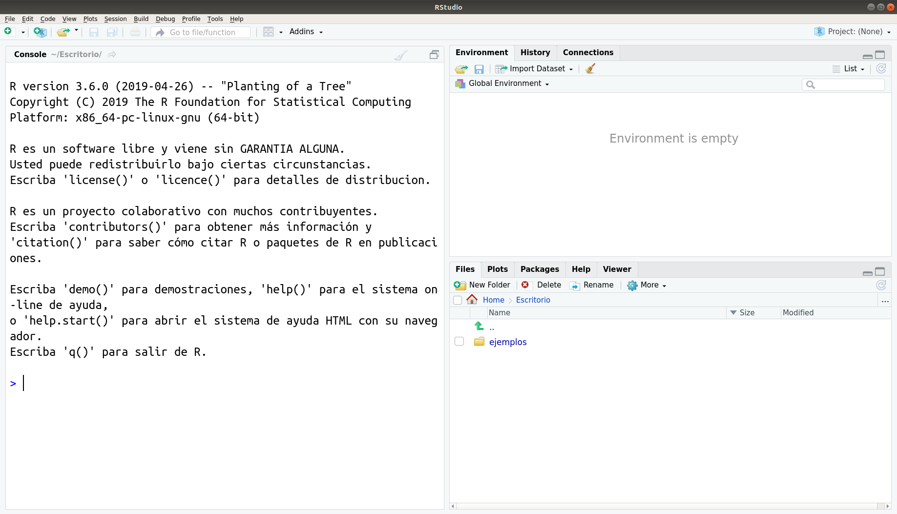
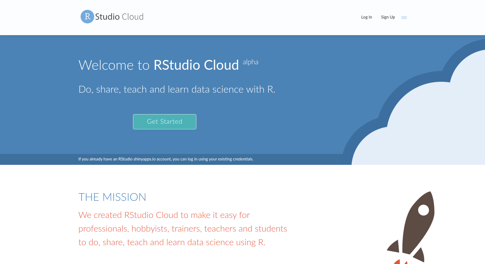
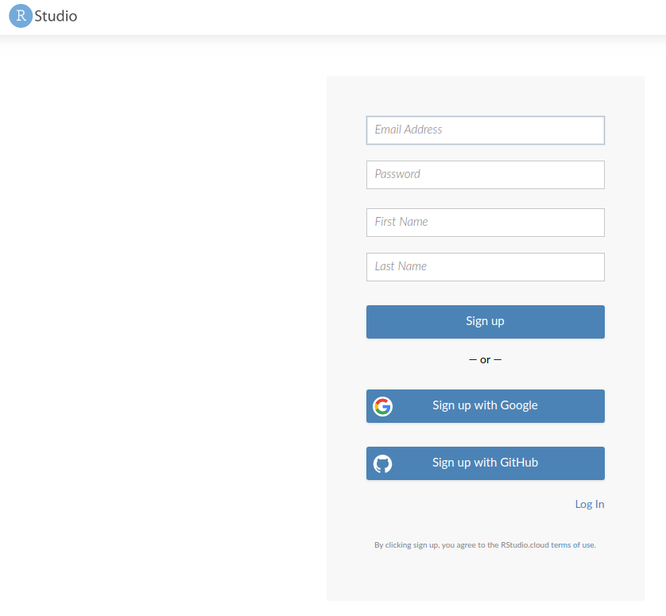
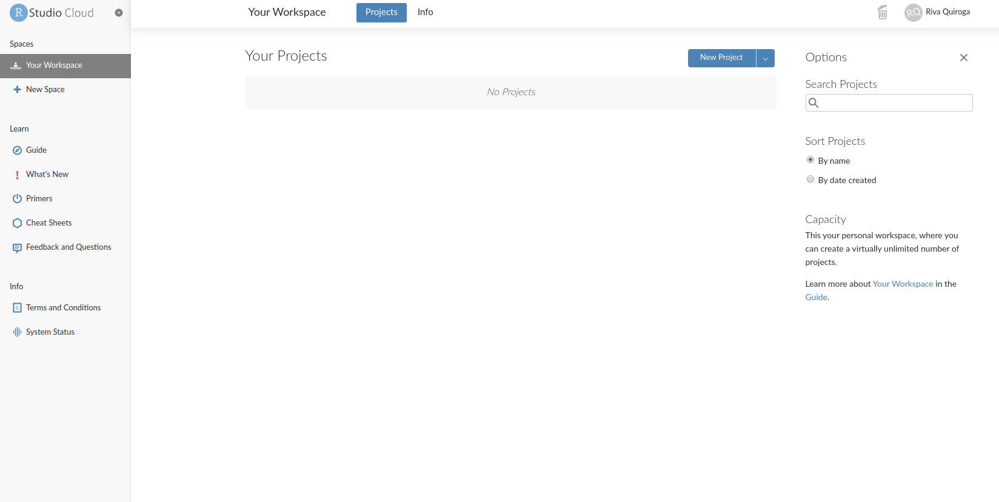
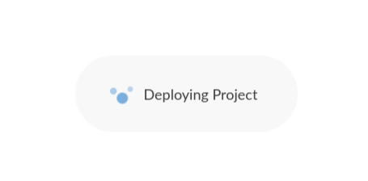
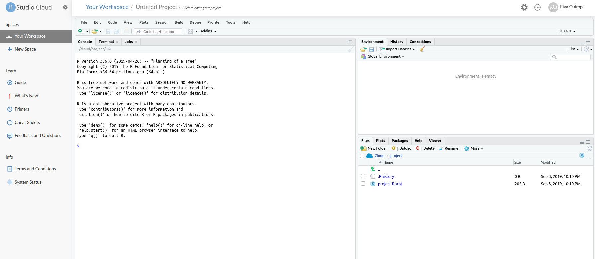

# Módulo Herramientas computacionales - sesiones 1 y 2

> Docentes: [Gabriela Sandoval](https://twitter.com/gabysandovalm) y [Riva Quiroga](https://twitter.com/rivaquiroga)

Durante las primeras dos clases de este módulo nos familiarizaremos con R y el entorno de trabajo RStudio. A continuación encontrarás las indicaciones que es necesario que revises __antes de la primera clase (11 de junio)__ para que puedas preparte y participar sin problemas ese día. Estas indicaciones abordan dos aspectos: cómo preparar tu computador y cómo preparar tu espacio de trabajo. 

## Instalación de R y RStudio + RStudio Cloud

En este taller utilizaremos el lenguaje de programación R a través de una plataforma que facilita su uso: RStudio. RStudio es un IDE, es decir, un *Entorno de Desarrollo Integrado* (IDE es el acrónimo de *Integrated Development Environment*). Esto quiere decir que RStudio es una aplicación que nos entrega herramientas para hacer más fácil el desarrollo de proyectos usando R.

Hay dos maneras de utilizarlo: en la nube o instalar todo localmente. Ambas tienen ventajas y desventajas:

**RStudio Cloud**

- *Ventajas*: no requiere instalar nada en tu computador; solo crearte una cuenta. Como tus proyectos están en línea, puedes acceder a ellos desde cualquier computador y compartirlos con otras personas.
- *Desventaja*: requiere conexión a internet. 

**RStudio en tu computador**

- *Ventajas*: no necesitas conexión a internet para trabajar (pero sí para instalar paquetes). Es más intuitivo trabajar con los archivos que están tu computador (tanto para leerlos como para crear archivos nuevos).
- *Desventajas*: implica instalar cosas. Ese proceso debería ser sencillo; sin embargo, cada computador es distinto y a veces es posible encontrarse con problemas. De todos modos, siempre es posible encontrar una solución en internet. 

A continuación mostraremos el paso a paso para ambas opciones. En estas sesiones utilizaremos principalmente R y RStudio en tu computador, pero también compartiremos código y haremos algunos ejercicios en RStudio Cloud, por lo que es necesario que tengas una cuenta. 

### Preparar tu computador

Necesitarás instalar tanto R como RStudio. Para ello, sigue los siguientes pasos (¡en orden!):

#### 1. Instala R

- Puedes descargar R desde https://cran.r-project.org/. Debes elegir la opción que corresponda, según tu sistema operativo.

Si utilizas Windows, te preguntará qué es lo que quieres instalar. Selecciona "base".

- Luego, sigue los pasos de instalación, tal como lo haces con cualquier programa. 

#### 2. Instala RStudio

- Una vez que R ha quedado correctamente instalado, descarga RStudio desde https://www.rstudio.com/products/rstudio/download/. Elige la primera opción, es decir, "RStudio Desktop Open Source License" (gratuita). 
- Instala RStudio en tu computador, tal como lo haces con cualquier programa. 

Si quedó todo bien instalado, cuando abras RStudio deberías ver algo parecido a esto (algunas cosas pueden variar según tu sistema operativo):

A lo largo del curso usaremos una versión reciente de R y RStudio, así que si tienes instalada una versión previa, puede que algunas cosas se vean un poco distintas. Versiones de R anteriores a la 3.5 harán que algunas cosas no funcionen, por lo que te sugerimos actualizar. La última versión de R es la 4.0.0 y la última de RStudio la 1.3.

**IMPORTANTE:** Si te encuentras con algún error durante este proceso, lo más probabable es que sea por alguna configuración de tu sistema operativo. En ese caso, la mejor manera de buscar una solución es copiar el error que arroja R, pegarlo en tu motor de búsqueda favorito y ver cómo alguien que se enfrentó a eso antes lo resolvió. 

### RStudio Cloud

#### 1. Accede a [rstudio.cloud](https://rstudio.cloud/)

#### 2. Crea una cuenta
Haz clic en "Sign up" e ingresa tus datos. 

Una vez que hayas creado una cuenta, verás algo así. Este es tu espacio de trabajo. 

Para poder empezar a trabajar en RStudio Cloud necesitas crear un proyecto. Para ello, haz clic en "New Project". Puede tomas alrededor de un minuto en crear:

Cuando esté listo, verás algo así:

¡Listo! Ya tienes todo lo necesario para la clase.

## Organización para la clase 

Durante la sesión iremos escribiendo código en vivo. Lo ideal es que vayas replicando en tu computador lo que hagamos. Para ello, es necesaroi que pienses en alguna configuración de pantalla que te permita ir mirando lo que hacemos en Zoom y replicándolo en la ventana de RStudio.  

A continucación hay algunas opciones:

### Una mitad de la pantalla para cada cosa

Es la opción más simple y no requieres nada más que tu computador. 

### Una segunda pantalla

Esta es la opción más cómoda, pero no siempre es posible porque requieres más cosas que solo tu computador. Aquí van algunas ideas, en caso de que no tengas un segundo monitor.

#### Conectar tu computador a un televisor

Luego de conectarlo, configura tu computador para que las pantallas no se dupliquen, sino que veas dos cosas distintas en cada una. Así podrás trabajar en tu computador e ir mirando el taller en el televisor:

#### Usar otro dispositivo

Si tienes una tablet, puedes conectarte a Zoom desde ella para participar en el taller y en paralelo trabajar en tu computador.

